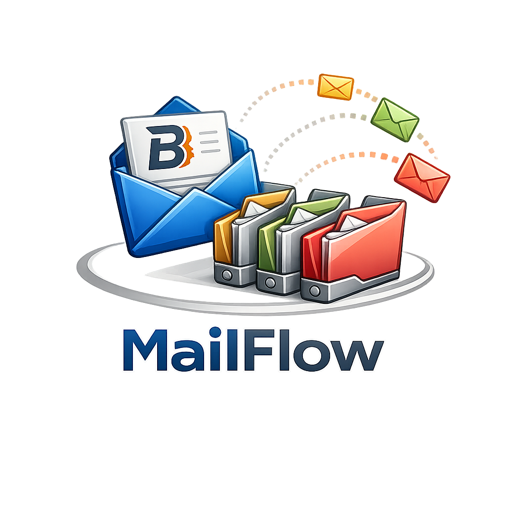

# MailFlow Archivist



MailFlow Archivist est une application desktop Windows pour preparer et archiver les e-mails Outlook classes par projet vers les dossiers locaux Balz Metal Sa.

Le MVP est non destructif :

- aucun mail Outlook n'est supprime ;
- aucun fichier existant n'est ecrase sans confirmation explicite ;
- les decisions passent par une previsualisation ;
- SQLite garde une trace des mails archives pour eviter les doublons.

## Etat de cette base

Cette premiere tranche met en place :

- architecture `src/mailflow` ;
- modeles metier typés avec `pydantic` ;
- parseur de numeros projet ;
- configuration JSON et stockage securise de cle OpenAI via `keyring` ;
- classification semantique IA strictement limitee a trois categories ;
- moteur de decision ;
- stockage SQLite ;
- scanner et exporteur Outlook mockables ;
- service de scan Outlook par compte, racine, annee et projet optionnel ;
- pipeline IA + annuaire + garde-fous metier + decision ;
- hierarchie limitee a `Correspondance`, `Fournisseurs/Demande de prix`, `Fournisseurs/Commande`,
  puis entreprise ;
- annuaire SQLite evolutif alimente par les domaines et contacts Outlook ;
- previsualisateur d'arborescence avec renommage et fusion avant archivage ;
- choix OpenAI ou Ollama local dans l'interface, clé OpenAI dans `keyring` et test visuel ;
- recherche de mises a jour depuis l'application avec lancement de l'installateur ;
- logo officiel MailFlow utilise dans l'application, l'icone Windows et l'app macOS ;
- resume projet automatique dans l'inspecteur et dans le journal HTML ;
- export HTML projet centralise dans `Correspondance` avec pieces jointes liees ;
- surveillance Outlook par scan regulier avec confirmation avant mise a jour HTML ;
- export CSV de rapport sans corps de mails ;
- interface PySide6 avec recherche, filtres de statut et aperçu de lecture ;
- tests unitaires et smoke tests.

## Export HTML projet

Le bouton `Exporter HTML projet` cree un journal par projet scanne :

```text
[Projet]\Correspondance\2025-4893 - Correspondance projet.html
[Projet]\Correspondance\2025-4893 - pieces jointes\
```

Le HTML regroupe les mails envoyes et recus dans la meme arborescence que la
previsualisation MailFlow. Un panneau lateral permet de naviguer par branche de
dossiers, et les mails sont affiches sous leur dossier cible. La recherche, les filtres
et les liens relatifs vers les pieces jointes restent disponibles. Les liens s'ouvrent
dans un nouvel onglet/fenetre pour mieux fonctionner aussi sur macOS. Le HTML contient
aussi un lien local direct, et l'export demande a OneDrive/Windows de garder les pieces
jointes disponibles localement quand elles sont dans un dossier OneDrive. Les pieces
jointes deja presentes sont reutilisees et ne sont pas ecrasees.

Un bloc `Resume projet` est ajoute en haut du HTML et dans l'inspecteur MailFlow. Il
donne une synthese globale des echanges, separe les points clients et fournisseurs,
liste les commandes/suivis de commande detectes et remonte les problemes ou
reclamations quand des indices existent. Cette synthese est construite depuis les
decisions de classement, l'annuaire, les sujets, les extraits et les resumes IA deja
disponibles ; elle ne declenche pas d'envoi supplementaire a l'IA.

Les destinations proposees sont limitees a trois dossiers metier :
`Correspondance/Entreprise`, `Fournisseurs/Demande de prix/Entreprise` et
`Fournisseurs/Commande/Entreprise`.
`Correspondance` est reserve aux clients. Un mail fournisseur ne part jamais en
`Correspondance` : il va en demande de prix, en commande, ou en `A verifier` si
MailFlow ne peut pas choisir avec certitude.
L'annuaire local peut etre alimente depuis tout l'historique Outlook projet :
une adresse ou un domaine connu, par exemple `@gva.ch`, prend le pas sur les
heuristiques de nom et permet de classer directement sous l'entreprise officielle.
L'onglet `Annuaire` permet aussi d'attribuer un role global a chaque entreprise ;
ce role devient la regle de base pour tous les projets existants et futurs.
Chaque scan, manuel ou par la surveillance, enregistre automatiquement dans l'annuaire
les contacts externes des mails lus. Lors d'une correction manuelle, choisir `Client`
ou `Fournisseur` enregistre ce role pour l'entreprise et l'applique aussitot aux autres
mails de cette entreprise dans la previsualisation (hors mails archives), puis aux
scans suivants.
Le journal HTML permet aussi de filtrer par dossier cible.

Avant un scan manuel, MailFlow affiche tous les dossiers projet Outlook de l'annee
selectionnee. L'utilisateur choisit les dossiers a traiter avec des cases a cocher ;
les boutons permettent aussi de tout selectionner ou tout deselectionner. Apres le
scan, le panneau `Arborescence` affiche les dossiers proposes avec le nombre de mails.
L'utilisateur peut renommer un dossier ou fusionner deux dossiers detectes comme
doublons avant toute creation de fichiers.

Les images integrees dans le corps des mails, comme les logos de signature, ne sont pas
exportees comme pieces jointes. Elles sont affichees directement dans le journal HTML.

La case `Surveillance Outlook` controle toutes les 5 minutes tous les dossiers projet
de l'annee selectionnee, quelle que soit la selection du dernier scan manuel. Le
controle courant ne lit que les `EntryID` Outlook ; le corps, les pieces jointes et la
classification IA ne sont charges que pour les nouveaux identifiants. Si une
previsualisation est deja ouverte dans la fenetre, la surveillance se met en attente
afin de ne pas ecraser les corrections manuelles.

Quand la surveillance est active, fermer la fenetre masque MailFlow dans la zone de
notification au lieu de l'arreter. Le menu de l'icone permet de rouvrir l'application,
d'activer ou desactiver la surveillance, ou de quitter completement.

## Mode IA

Le mode IA se configure dans `Réglages` : `activee` classe chaque mail
avec l'IA, tandis que `desactivee` place les lignes en verification manuelle. Il
n'existe aucun classement de secours par mots-cles.

L'annuaire fixe l'entreprise et son role global. L'IA choisit uniquement entre
`Correspondance`, `Demande de prix` et `Commande`. L'historique recent de l'entreprise
et les corrections manuelles verifiees lui sont transmis comme contexte. Une
correction apprend une decision complete, jamais un terme isole.

Le moteur se choisit dans `Réglages` : **OpenAI (API)** ou **Ollama (local)**.
Ollama utilise un modèle installé sur le PC sans clé API ; les mails restent sur cette
machine. Le modèle local proposé est **Qwen3.5 4B** (`qwen3.5:4b`). Le bouton
d'actualisation liste les modèles installés et le test local classe un mail fictif.
Une panne locale ne déclenche jamais un appel OpenAI. Les réglages de chaque moteur
sont conservés séparément. Voir [l'installation locale](docs/ollama.md).

Pour OpenAI, le modèle par défaut est **GPT-6 Astra** (`gpt-6-astra`), appelé via Responses API
avec une sortie structurée stricte et un effort de raisonnement `low`. Le délai réseau
par défaut est de 60 secondes ; le SDK peut réessayer une fois. L'attente des réponses
IA laisse l'interface réactive. Les commandes qui modifieraient le travail en cours
sont temporairement désactivées.

Au chargement d'une ancienne configuration, l'ancien défaut `gpt-5.4-nano` est migré
vers Astra. Un autre modèle configuré et le mode IA désactivé sont conservés. La
sauvegarde des réglages mémorise cette migration ; le sélecteur reste modifiable.
L'accès au modèle dépend du compte OpenAI et se vérifie avec `Tester IA`.

Les échecs IA restent en vérification manuelle avec une explication visible. Aucun
classement par mots-clés ne remplace une réponse manquante. Les requêtes utilisent
`store=False` ; cela ne constitue pas une garantie de rétention nulle chez le fournisseur.

La cle OpenAI est enregistree dans le coffre du systeme via `keyring`, jamais dans le
fichier JSON ni dans les logs. Le bouton `Tester IA` lance un mini appel structure sur
un mail fictif et affiche un statut colore. L'option d'envoi du corps peut etre
desactivee pour n'envoyer que sujet, metadonnees et noms des pieces jointes.

Quand l'IA intervient, l'apercu du mail affiche la decision IA, son resume court et
l'explication en quelques mots.

## Commandes utiles

```powershell
python -m pip install -e ".[dev]"
python -m pytest
python -m ruff check .
python -m mypy src tests
python -m mailflow --diagnose-outlook
python -m mailflow --import-contact-directory --account "prenom.nom@balzmetal.ch" --outlook-root "Boite de reception"
```

Sur ce poste, si `python` pointe vers l'alias Microsoft Store, utiliser un Python 3.11+ explicite ou le runtime configure dans Codex.

La [revue du projet](docs/project-review.md) décrit l'architecture, les corrections,
les contrôles et les limites de validation. Le [guide utilisateur](docs/user-guide.md)
présente le parcours et les réglages. Les pushes sur `main` et les pull requests
déclenchent désormais tests, Ruff et mypy sur Windows et macOS, sans publier de release.

## Installation et releases

Le workflow GitHub Actions `.github/workflows/release.yml` construit des installateurs
directement utilisables :

- Windows : `MailFlow-Archivist-Setup.exe` ;
- macOS : `MailFlow-Archivist.dmg`.

Dans l'application, le bouton `Rechercher mise a jour` interroge la derniere release
GitHub, telecharge l'installateur adapte a la plateforme et le lance apres confirmation.

Pour publier une release :

```powershell
git tag vX.Y.Z
git push origin main
git push origin vX.Y.Z
```

Voir `docs/release.md` pour les details.
