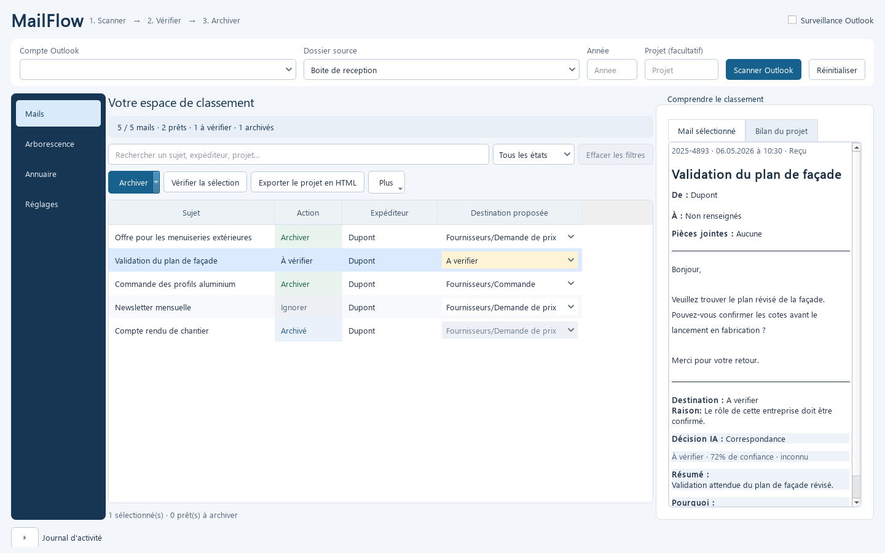
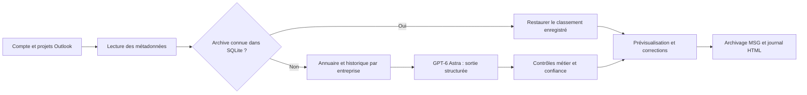

# Revue du projet — 22 septembre 2026

Cette revue couvre l'application locale : configuration et démarrage, adaptateurs
Outlook, classification, décisions d'archivage, SQLite, export MSG/HTML, annuaire,
surveillance, interface Qt, mises à jour, tests et workflows de livraison. Les
améliorations étaient alors implémentées localement, avant la préparation de la
version 0.8.6. La version distribuée au moment de cette revue était la 0.8.5.
Voir [les notes de release](release.md) pour la livraison de ces changements.



[Vue compacte avec aperçu masqué](images/mailflow-compact.png).

## Compréhension et méthode retenue

MailFlow prépare l'archivage des échanges Outlook dans les dossiers de projets
existants. Il conserve les messages dans Outlook et garde la trace des archives dans
SQLite. L'annuaire local identifie l'entreprise et son rôle ; l'IA propose la phase
commerciale, et les contrôles locaux déterminent si une validation humaine est requise.



La bonne évolution consiste à conserver cette séparation, à rendre le parcours
lisible et à fiabiliser les effets de bord. Les trois catégories restent
`Correspondance`, `Demande de prix` et `Commande`. L'IA n'obtient aucun outil pour
modifier les fichiers ou les mails ; une sortie invalide ou une panne conserve la
ligne en vérification. Aucun classement par mots-clés ne sert de secours.

Les points déjà solides sont l'injection des adaptateurs Outlook/OpenAI, les modèles
Pydantic, les règles de destination hors du prompt, la clé dans le coffre système,
la surveillance incrémentale et la conservation de la sélection par `EntryID`.

## Constats et corrections

| Priorité | Constat vérifié | Correction apportée |
| --- | --- | --- |
| Haute | L'archivage global réactivait les lignes ignorées avant même la confirmation. | Seules les lignes déjà admissibles sont archivées ; annuler ne change pas le lot. |
| Haute | Une reclassification ou une modification de l'annuaire pouvait réactiver un mail ignoré ou déplacer la destination d'une archive. | Protection explicite des états Ignoré/Archivé et des destinations enregistrées. |
| Haute | Deux pièces jointes homonymes pouvaient pointer vers le même fichier malgré un contenu différent. | Comparaison du contenu et suffixes distincts ; réutilisation uniquement si les contenus sont identiques. |
| Haute | Des erreurs de classification étaient absorbées et présentées comme une IA non appelée. | Explication locale visible pour accès refusé, quota, délai ou échec ; aucun contenu d'exception distante recopié. |
| Haute | Le scan pouvait remplacer les références Outlook alors que la construction de la nouvelle prévisualisation échouait. | Publication de l'état du contrôleur après la réussite du lot. |
| Haute | Les nouveaux réglages IA n'étaient pas appliqués à la surveillance et à la reclassification du lot déjà chargé. | Application du modèle, de la clé, du mode et de la confidentialité au pipeline actif sans perdre les mails. |
| Haute | Une erreur d'export de pièce jointe pouvait laisser une archive partiellement écrite. | Préparation MSG/PJ avant publication, créations exclusives et restauration en cas d'échec de publication. |
| Moyenne | Le défaut de modèle et la dépendance minimale ne correspondaient plus au fonctionnement souhaité. | Astra par défaut, migration versionnée des anciens réglages et SDK Responses vérifié. |
| Moyenne | Les appels réseau IA bloquaient la boucle d'événements Qt. | Attente réseau dans un thread ; commandes mutantes et surveillance protégées pendant l'opération. |
| Moyenne | Les adresses Exchange internes pouvaient être utilisées à la place des adresses SMTP. | Résolution SMTP de l'expéditeur et des destinataires avec replis adaptés. |
| Moyenne | Les contextes SQLite validaient les transactions sans fermer les connexions. | Contexte partagé qui ferme explicitement les connexions. |
| Moyenne | Un nouvel examen de mails archivés pouvait entraîner des appels IA inutiles. | Lecture de leur classement dans SQLite, sans perdre les catégories du journal HTML ni du bilan projet. |
| Moyenne | Un rafraîchissement HTML interrompu pouvait remplacer le document utilisable. | Écriture intermédiaire puis remplacement du document complet. |
| Moyenne | La prévalidation pouvait créer des dossiers pour des lignes ignorées ; une erreur d'E/S bloquait le lot. | Prévalidation des seules lignes admissibles et erreurs isolées par mail. |
| Moyenne | Les contrôles automatisés n'étaient lancés qu'au moment de publier. | Workflow CI sur les pushes `main` et les pull requests, Windows et macOS. |
| Moyenne | Un exemple de classement validé restait réutilisable après une correction qui le rendait incertain. | Révocation de l'exemple obsolète et actualisation du contexte en mémoire. |
| Moyenne | Un installateur incomplet pouvait être proposé à l'exécution. | Téléchargement HTTPS, taille vérifiée et vérification du SHA256 lorsqu'il est fourni par GitHub. |

L'archive locale est journalisée avant l'application de la catégorie Outlook. Si
Outlook refuse cette catégorie, le résultat affiche un avertissement et conserve
l'archive réussie, ce qui évite de la considérer comme entièrement échouée.

| Dimension | Appréciation après corrections | Réserve principale |
| --- | --- | --- |
| Sécurité et confidentialité | Renforcées | Conditions de rétention OpenAI et accès aux dossiers du poste à gérer selon l'usage. |
| Exactitude et intégrité | Régressions identifiées couvertes par tests | Vérification métier Astra et essai Outlook réel nécessaires. |
| Performances et réactivité | Attente réseau améliorée, appels redondants réduits | Pas de mesure sur un gros historique ; opérations COM encore synchrones. |
| Maintenabilité | Modules séparés et CI améliorée | Fenêtre principale encore volumineuse. |

La revue croisée a également détecté et corrigé une régression pendant ce travail :
éviter l'appel IA sur une archive sans restaurer ses métadonnées perdait son dossier
dans le HTML. La récupération du journal SQLite conserve maintenant la destination
exacte, le type et la confiance. Un simple marquage Outlook sans entrée SQLite
conserve son analyse pour construire les informations manquantes.

## Interface et expérience utilisateur

Le parcours reste dans l'application Windows existante. L'en-tête sépare le compte,
le dossier source, l'année et le projet optionnel. La navigation latérale donne accès
aux mails, à l'arborescence, à l'annuaire et aux réglages.

- Une palette commune, des espacements réguliers et une hiérarchie de titres
  remplacent les styles dispersés des principaux panneaux.
- Les compteurs et filtres distinguent les mails prêts, à vérifier, ignorés et archivés.
- La recherche est locale, insensible aux accents et ne déclenche aucun appel IA.
- Les états vides expliquent comment commencer ou comment retrouver les résultats.
- La lecture du mail privilégie le sujet, les correspondants, le contenu et la
  destination ; le bilan projet dispose de son propre onglet.
- La correction conserve la sélection et le défilement. Les colonnes ne sont plus
  recalculées après chaque modification.
- Les lignes masquées ne participent pas aux actions sur la sélection ; l'archivage
  global garde un libellé et une confirmation explicites.
- Le focus clavier et les raccourcis de recherche et d'archivage sont disponibles.

Le socle `QTableWidget` et les attributs de fenêtre utilisés par les tests sont
conservés. Une conversion complète vers `QAbstractTableModel` serait pertinente pour
de très gros lots ; elle mérite une évolution séparée avec mesure des performances.

## Migration GPT-6 Astra

La [documentation officielle de migration](https://developers.openai.com/api/docs/guides/latest-model)
a été vérifiée pour le modèle explicitement demandé. L'application utilise
`gpt-6-astra`, Responses API et un schéma strict construit avec Pydantic. Pour Astra,
le raisonnement vaut `low`, aucun paramètre de sampling incompatible n'est transmis,
et les réponses refusées ou incomplètes sont écartées.

Le délai réseau par défaut est de 60 secondes, le SDK réessaie au plus une fois et
la sortie est plafonnée à 4096 tokens. `store=False` évite de demander le stockage de
la réponse comme ressource API. Cette option ne garantit pas une rétention nulle
chez OpenAI. Le prompt traite les instructions trouvées dans les mails et l'historique
comme du contenu à classer et réaffirme les limites des trois catégories.

La migration versionnée remplace l'ancien défaut `gpt-5.4-nano`, conserve les autres
modèles explicitement configurés et respecte le mode IA désactivé. Elle devient
persistante lors de la sauvegarde des réglages. Aucun fichier de configuration réel
ni secret du poste n'a été modifié pour la validation.

## Validation et limites

L'état initial comptait **242 tests réussis**. Les nouvelles régressions couvrent les
appels SDK avec transport HTTP simulé, les réglages anciens, les refus et réponses
interrompues, les archives récupérées depuis SQLite, les fichiers homonymes, les
états de prévisualisation et les interactions Qt.

Les captures Qt utilisent des mails fictifs et un contrôleur injecté. Elles permettent
de vérifier les dimensions et le rendu, sans ouvrir les boîtes mail ni déclencher
d'appel OpenAI. Le test du worker vérifie qu'un timer du fil principal continue de
s'exécuter pendant l'attente réseau, ainsi que la remontée des exceptions.

La validation locale finale est consignée à la fin de ce document. Les limites qui
restent à prendre en compte sont les suivantes :

1. **Qualité métier et accès Astra** : pas d'appel facturé ni de corpus de vrais mails
   envoyé. La réussite des contrats SDK ne mesure ni précision, ni coût, ni latence
   réelle. Le bouton Tester IA vérifie l'accès avec un mail fictif ; un corpus revu
   humainement est nécessaire pour comparer les modèles sur le métier.
2. **Outlook réel et volumes** : les adaptateurs sont testés avec des doubles. La
   lecture Outlook, les imports et les exports restent synchrones. Une orchestration
   dédiée, avec gestion explicite de COM et annulation, reste le chantier principal
   pour les grands lots ; déplacer arbitrairement le contrôleur dans un thread serait
   une mauvaise solution.
3. **Maintenabilité UI** : la fenêtre principale garde de nombreuses responsabilités.
   Les styles et l'attente réseau sont extraits, mais la séparation en vues et
   présentateurs et la persistance de l'agencement restent à poursuivre.
4. **Livraison lors de cette revue** : aucun push, tag, build d'installateur, test
   macOS réel ou déploiement n'avait été effectué. Les validations de publication
   sont suivies séparément dans GitHub Actions.
5. **Reprise après panne SQLite** : si l'enregistrement du journal échoue après
   l'export, les fichiers complets restent sur disque sans catégorie Outlook.
   Une nouvelle tentative peut produire une copie ; une reprise transactionnelle
   coordonnant fichiers et base reste à concevoir.
6. **Versions de mise à jour** : la comparaison existante utilise les groupes
   numériques du numéro de version. Elle convient au flux actuel de releases stables,
   mais devra évoluer avant de proposer des préversions dans l'application.

## Commandes de contrôle

```powershell
$env:QT_QPA_PLATFORM = 'offscreen'
& .\.venv312\Scripts\python.exe -m pytest -q --basetemp=.pytest_cache/final-review
& .\.venv312\Scripts\python.exe -m ruff check .
& .\.venv312\Scripts\python.exe -m mypy src tests
git diff --check
```

Le dossier temporaire explicite est nécessaire dans l'environnement Codex de ce
poste : l'ancien répertoire temporaire global de pytest n'y est pas accessible.

## Résultat final local

- **305 tests réussis**, contre 242 avant modifications.
- **Ruff : réussi**, sans anomalie.
- **mypy : réussi**, 92 fichiers contrôlés.
- **git diff --check : réussi** ; Git signale uniquement ses conversions LF/CRLF.
- **Paquet wheel construit**, avec vérification de la présence des nouveaux modules
  et du chevron SVG. Ce paquet de contrôle n'est pas un installateur publié.
- **Rendu Qt inspecté** à 1440 × 900 et 1040 × 720, avec mails fictifs ; vue compacte
  également vérifiée avec l'aperçu masqué.

Les tests ne sollicitent pas Outlook réel ni l'API OpenAI. L'accès Astra, la précision
sur les dossiers métier, les coûts et les temps réels restent donc à mesurer.
